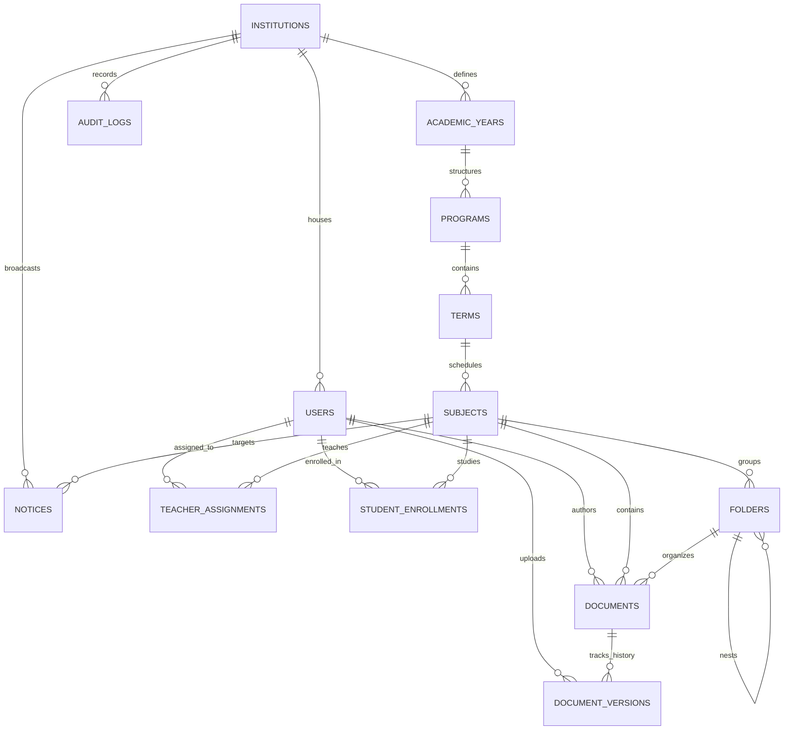
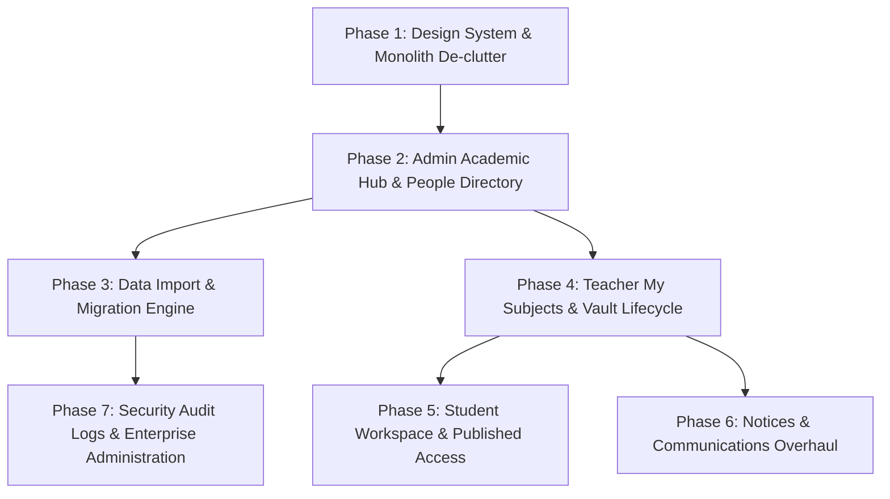

# EduVault — Product Architecture & Design System Blueprint v1
**Document Version:** 1.0.0  
**Status:** Authoritative Blueprint & Master Architecture Specification  
**Scope:** Core Domain, Entity Model, Role Workflows, Import/Migration, Navigation, Design System, Roadmap  
**Target Platform:** EduVault Institutional Academic Security & Workspace Platform  

---

## Table of Contents
1. [Product Definition & Philosophy](#1-product-definition--philosophy)
2. [Current System & Legacy Inventory](#2-current-system--legacy-inventory)
3. [Core Domain Model & Entity Dictionary](#3-core-domain-model--entity-dictionary)
4. [Entity Relationship Model (ERD)](#4-entity-relationship-model-erd)
5. [Institutional Terminology & Configurable Display System](#5-institutional-terminology--configurable-display-system)
6. [Historical Data Import & Migration Architecture](#6-historical-data-import--migration-architecture)
7. [Role Architecture & Operational Experiences](#7-role-architecture--operational-experiences)
   - 7.1 [Administrator Architecture](#71-administrator-architecture)
   - 7.2 [Teacher Architecture](#72-teacher-architecture)
   - 7.3 [Student Architecture](#73-student-architecture)
8. [The "My Subjects" Architecture](#8-the-my-subjects-architecture)
9. [Academic Materials & Document Version Lifecycle](#9-academic-materials--document-version-lifecycle)
10. [Documents vs Folders: Relational Curriculum vs File Storage](#10-documents-vs-folders-relational-curriculum-vs-file-storage)
11. [Administrative Workflows & Form Specifications](#11-administrative-workflows--form-specifications)
12. [Design System v1](#12-design-system-v1)
13. [Authoritative Terminology Glossary](#13-authoritative-terminology-glossary)
14. [Navigation Architecture v2](#14-navigation-architecture-v2)
15. [Public Home vs Authenticated Workspace Boundary](#15-public-home-vs-authenticated-workspace-boundary)
16. [Account, Identity & Security UX](#16-account-identity--security-ux)
17. [Tri-Theme Matrix (Light, Dark, AMOLED)](#17-tri-theme-matrix-light-dark-amoled)
18. [Screen Inventory & Maturity State](#18-screen-inventory--maturity-state)
19. [Implementation Roadmap & Dependency Graph](#19-implementation-roadmap--dependency-graph)
20. [Current vs Future Feature Matrix](#20-current-vs-future-feature-matrix)
21. [Open Architecture Decisions & Unresolved Questions](#21-open-architecture-decisions--unresolved-questions)

---

## 1. Product Definition & Philosophy

### 1.1 What EduVault Is
**EduVault is a secure, institutional academic workspace** purpose-built for schools, colleges, and universities to:
1. Define, manage, and govern hierarchical academic structures (years, programs, terms, subjects) and academic stakeholders (administrators, faculty, students).
2. Migrate and ingest existing institutional rosters, curriculum mappings, and historical course data without requiring manual record-by-record re-entry.
3. Establish verified academic assignments and enrollments, ensuring faculty and students access only their authorized academic context.
4. Manage, version, and protect curriculum materials through a deterministic publication lifecycle (`Draft` → `Locked` → `Published` → `Archived`).
5. Deliver secure, verifiable institutional announcements and course-scoped notices with rigorous tenant isolation.

### 1.2 What EduVault Is NOT
* **Not a generic cloud-drive clone:** EduVault is not Google Drive, Dropbox, or OneDrive. Generic file trees where users arbitrarily create root folders ("My Files", "Shared with me", "Starred") undermine academic hierarchy and access compliance.
* **Not an ad-hoc personal storage locker:** Materials exist because they serve a subject curriculum inside a term, program, and academic year.
* **Not a toy education dashboard:** EduVault rejects childish color palettes, uncurated gamification, and superficial template widgets in favor of calm, institutional SaaS rigor suitable for university registrars, deans, school principals, faculty, and enrolled scholars.

### 1.3 The Google Drive Relationship
Google Drive provides valuable interaction conventions:
* Rapid search, preview modals, drag-and-drop file upload, and folder grouping *inside a specific subject vault*.
* However, Google Drive’s global unbounded hierarchy does **not** govern EduVault's data architecture. In EduVault, **the relational curriculum structure is authoritative; storage folders are merely secondary layout containers inside a subject**.

```
┌─────────────────────────────────────────────────────────────┐
│                    EDUVAULT PRODUCT CORE                    │
├───────────────────────────────┬─────────────────────────────┤
│     INSTITUTIONAL DOMAIN      │    INTERACTION PARADIGM     │
│  • Academic Hierarchy         │  • Familiar File Uploads    │
│  • Program / Term Scoping     │  • Subject-Scoped Folders   │
│  • Governed Enrollments       │  • PDF / Document Preview   │
│  • Deterministic Lifecycle    │  • Global Academic Search   │
│  • Strict Tenant Isolation    │  • Rapid Inline Filtering   │
└───────────────────────────────┴─────────────────────────────┘
```

---

## 2. Current System & Legacy Inventory

### 2.1 Current State Audit

| Element | Code Location | Status | Assessment & Decision |
| :--- | :--- | :--- | :--- |
| **Supabase Schema (Tasks 1–11)** | `supabase/schema.sql` | **Authoritative** | High quality, 13 core relational tables, strict RLS helper functions, automated audit triggers, UUID primary keys. |
| **Supabase Authentication** | `src/lib/supabase.js` | **Authoritative** | Real JWT session lifecycle, password auth, `public.users` profile synchronization, role extraction. |
| **Public Home Page** | `src/App.jsx` (lines 1250–1450) | **Current / Stable** | Clean institutional marketing presentation: Hero, 4-stage Workflow, Audience cards, Institutional Portals, Footer. |
| **3-Mode Theme Switcher** | `src/App.jsx` & `src/index.css` | **Current / Stable** | 3-state icon group (`Sun`, `Moon`, `CircleDot`) controlling Light, Dark, and AMOLED modes with `localStorage` persistence. |
| **Account Menu & Deliberate Sign-Out** | `src/App.jsx` & `src/index.css` | **Current / Stable** | `[PR] Prithvi Raju (ADMIN)` avatar pill trigger, role/institution dropdown card, deliberate modal confirmation dialog. |
| **Academic Manager Component** | `src/AdminAcademicManager.jsx` | **Current (Admin)** | Real cascading queries (Years → Programs → Terms → Subjects → Assignments/Enrollments). Needs modularization. |
| **My Subjects Component** | `src/MySubjects.jsx` | **Current (Teacher/Student)**| Real assignment/enrollment queries. Needs role-distinct views and empty-state polish. |
| **Subject Vault Component** | `src/SubjectVault.jsx` | **Current / Partial** | Handles real document versions, upload to `eduvault-documents` storage bucket, role-filtered publication view. |
| **Notices Component** | `src/Notices.jsx` | **Current / Stable** | Supports institution-wide (`subject_id = null`) and course-specific notices with author resolution. |
| **Global Navigation (12D.1)** | `src/App.jsx` | **Current / Mixed** | 5 primary academic items (Home, Academic Structure, My Subjects, Materials, Notices). Collapsed legacy toggle. |
| **Dashboard Metrics (12D.2)** | `src/App.jsx` | **Current (Home)** | Real `Promise.allSettled` count chips (Years, Programs, Subjects, Docs, Notices) without fake metrics. |
| **`INITIAL_DOCUMENTS` / `INITIAL_FOLDERS`** | `src/App.jsx` | **Legacy / Temporary** | Hardcoded mock arrays retained only to prevent canvas blanking in legacy views. Must be completely eliminated in Phase 1. |
| **`.gdrive-*` CSS Classes** | `src/index.css` | **Legacy / Structural** | Layout wrapper class names (`.gdrive-sidebar`, `.gdrive-layout`). Must be systematically renamed to `.ev-*`. |
| **Legacy Cloud Items** | `src/App.jsx` | **Legacy / Deprecated** | "Shared with me", "Recent", "Starred", "Trash", "Storage" hidden under collapsed dropdown. Scheduled for deletion. |

---

## 3. Core Domain Model & Entity Dictionary

EduVault's authoritative backend consists of 13 primary relational tables in PostgreSQL (`public` schema), managed via Supabase.

```
                  ┌──────────────────┐
                  │   institutions   │
                  └─────────┬────────┘
                            │ 1:N
           ┌────────────────┼────────────────┐
           │ 1:N            │ 1:N            │ 1:N
   ┌───────▼────────┐ ┌─────▼──────┐ ┌───────▼────────┐
   │ academic_years │ │   users    │ │    notices     │
   └───────┬────────┘ └─────┬──────┘ └────────────────┘
           │ 1:N            │
     ┌─────▼──────┐         │ (Teacher / Student)
     │  programs  │         │
     └─────┬──────┘         │
           │ 1:N            │
      ┌────▼─────┐          │
      │  terms   │          │
      └────┬─────┘          │
           │ 1:N            │
     ┌─────▼────────────────▼──────┐
     │          subjects           │
     └─────┬───────────────┬───────┘
           │ 1:N           │ 1:N
     ┌─────▼─────┐   ┌─────▼───────────────┐
     │  folders  │   │ teacher_assignments │
     └─────┬─────┘   │ student_enrollments │
           │ 0..1:N  └─────────────────────┘
     ┌─────▼─────┐
     │ documents │
     └─────┬─────┘
           │ 1:N
┌──────────▼─────────┐
│ document_versions  │
└────────────────────┘
```

### 3.1 Detailed Entity Dictionary

#### 1. `institutions` (Tenant Root)
* **Purpose:** Multi-tenant root container. Every piece of institutional data is isolated to this tenant.
* **Owner:** Platform Super-Admin / System Bootstrap.
* **Fields:** `id` (UUID), `name` (text), `type` ('school' | 'university'), `created_at` (timestamptz).
* **Permissions:** 
  * Create: Super Admin / Bootstrap SQL script (Service Role).
  * Edit: Institutional `ADMIN`.
  * View: Any authenticated user belonging to that institution (`id = get_my_institution_id()`).
* **Scoping:** Root level. Not year-scoped. Persistent across academic lifecycles.

#### 2. `users` (Identity & Academic Stakeholders)
* **Purpose:** Extends `auth.users` with institutional tenancy and canonical role classification.
* **Owner:** Institution `ADMIN`.
* **Fields:** `id` (UUID references `auth.users`), `institution_id` (UUID references `institutions`), `email` (text unique), `full_name` (text), `role` ('ADMIN' | 'TEACHER' | 'STUDENT'), `created_at`, `updated_at`.
* **Permissions:**
  * Create/Edit: `ADMIN` within same institution.
  * View: All authenticated users within same institution.
* **Scoping:** Institution-scoped. Users persist across academic years; their assignments/enrollments are year-specific.

#### 3. `academic_years` (Temporal Academic Horizon)
* **Purpose:** Defines operational academic calendar cycles (e.g., "2025-2026", "2026-2027").
* **Owner:** Institution `ADMIN`.
* **Fields:** `id` (UUID), `institution_id` (UUID), `name` (text), `is_active` (boolean), `start_date` (date), `end_date` (date), `created_at`.
* **Constraints:** `UNIQUE(institution_id, name)`.
* **Permissions:** Create/Edit by `ADMIN`. View by all institution users.
* **Lifecycle State:** `is_active = true` denotes the current operational year. Non-active years are historical archives.

#### 4. `programs` (Academic Curriculum Streams / Grades)
* **Purpose:** Top-level academic program, degree, or grade level (e.g., "Class 10", "Grade 12", "B.Sc Computer Science", "Master of Business Administration").
* **Owner:** Institution `ADMIN`.
* **Fields:** `id` (UUID), `academic_year_id` (UUID), `name` (text), `created_at`.
* **Constraints:** `UNIQUE(academic_year_id, name)`.
* **Permissions:** Create/Edit by `ADMIN`. View by all institution users.
* **Scoping:** Academic-Year-scoped. Each academic year has its own program instance to allow yearly curriculum revisions without corrupting historical cohorts.

#### 5. `terms` (Sub-divisions / Semesters / Sections)
* **Purpose:** Academic periods within a program (e.g., "Term 1", "Semester 3", "Section A", "Fall 2026").
* **Owner:** Institution `ADMIN`.
* **Fields:** `id` (UUID), `program_id` (UUID), `name` (text), `created_at`.
* **Constraints:** `UNIQUE(program_id, name)`.
* **Permissions:** Create/Edit by `ADMIN`. View by all institution users.
* **Scoping:** Program-scoped.

#### 6. `subjects` (Core Curricular Unit / Course)
* **Purpose:** The primary academic unit of study, teaching, content delivery, and examination (e.g., "Physics 101", "Advanced Algorithms", "World History").
* **Owner:** Institution `ADMIN`.
* **Fields:** `id` (UUID), `term_id` (UUID), `name` (text), `code` (text nullable, e.g., "CS-501"), `created_at`.
* **Constraints:** `UNIQUE(term_id, name)`.
* **Permissions:** Create/Edit by `ADMIN`. View by all institution users.
* **Scoping:** Term-scoped.

#### 7. `teacher_assignments` (Faculty-Subject Binding)
* **Purpose:** Grants specific faculty members instructional and content-management authority over a subject.
* **Owner:** Institution `ADMIN`.
* **Fields:** `id` (UUID), `user_id` (UUID references `users`), `subject_id` (UUID references `subjects`), `created_at`.
* **Constraints:** `UNIQUE(user_id, subject_id)`.
* **Permissions:**
  * Create/Delete: `ADMIN`.
  * View: `ADMIN`, and `TEACHER` where `user_id = auth.uid()`.

#### 8. `student_enrollments` (Student-Subject Binding)
* **Purpose:** Enrolls a verified student into a subject, granting read-only access to published materials.
* **Owner:** Institution `ADMIN`.
* **Fields:** `id` (UUID), `user_id` (UUID references `users`), `subject_id` (UUID references `subjects`), `created_at`.
* **Constraints:** `UNIQUE(user_id, subject_id)`.
* **Permissions:**
  * Create/Delete: `ADMIN`.
  * View: `ADMIN`, `STUDENT` where `user_id = auth.uid()`, and `TEACHER` assigned to the same `subject_id`.

#### 9. `folders` (Organizational Vault Containers)
* **Purpose:** Organizes documents *within* a subject's vault (e.g., "Unit 1 — Quantum Mechanics", "Laboratory Guides").
* **Owner:** Assigned `TEACHER` or `ADMIN`.
* **Fields:** `id` (UUID), `subject_id` (UUID), `parent_folder_id` (UUID nullable references `folders`), `name` (text), `created_at`.
* **Permissions:**
  * Create/Edit/Delete: Assigned `TEACHER` and `ADMIN`.
  * View: Enrolled `STUDENT`, assigned `TEACHER`, and `ADMIN`.
* **Scoping:** Subject-scoped. Folders never exist outside of a subject.

#### 10. `documents` (Curriculum Document Metadata)
* **Purpose:** Logical record representing a syllabus, lecture presentation, assignment brief, or reading pack.
* **Owner:** Creating `TEACHER` or `ADMIN`.
* **Fields:** `id` (UUID), `subject_id` (UUID), `folder_id` (UUID nullable), `title` (text), `description` (text nullable), `status` ('DRAFT' | 'PUBLISHED' | 'ARCHIVED'), `created_by` (UUID), `created_at`, `updated_at`.
* **Permissions:**
  * Create/Edit/Delete: Assigned `TEACHER` and `ADMIN`.
  * View: `ADMIN`, assigned `TEACHER`, and enrolled `STUDENT` (STUDENT can **only** see `status = 'PUBLISHED'`).

#### 11. `document_versions` (Binary Version History)
* **Purpose:** Tracks immutable revisions, binary storage links, MIME types, and file sizes for a document.
* **Owner:** Uploading `TEACHER` or `ADMIN`.
* **Fields:** `id` (UUID), `document_id` (UUID), `version_number` (integer), `storage_path` (text), `file_type` (text), `file_size` (bigint bytes), `uploaded_by` (UUID nullable), `created_at`.
* **Storage Location:** Supabase Storage bucket `eduvault-documents`.
* **Permissions:** Inherits parent `documents` RLS rules. Students access latest version of PUBLISHED documents.

#### 12. `notices` (Announcements & Bulletins)
* **Purpose:** Official bulletins broadcast either institution-wide (`subject_id = null`) or scoped to a specific subject.
* **Owner:** `ADMIN` (for institution notices) or `TEACHER` (for assigned subject notices).
* **Fields:** `id` (UUID), `institution_id` (UUID), `subject_id` (UUID nullable), `title` (text), `content` (text), `created_by` (UUID), `created_at`.
* **Constraints:** Verified by trigger `notice_institution_check` ensuring `subject_id` belongs to the matching institution.
* **Permissions:**
  * Create/Edit/Delete: `ADMIN` for all; `TEACHER` for assigned subjects.
  * View: All institution members if `subject_id IS NULL`; enrolled students and assigned teachers if `subject_id` is specified.

#### 13. `audit_logs` (Security & Regulatory Ledger)
* **Purpose:** Immutable compliance ledger tracking document publication, security changes, and academic edits.
* **Owner:** System (automated security-definer triggers).
* **Fields:** `id` (UUID), `institution_id` (UUID), `user_id` (UUID), `action` (text), `entity_table` (text), `entity_id` (UUID), `metadata` (JSONB), `created_at`.
* **Permissions:** Read-only by `ADMIN`. Write by database triggers.

---

## 4. Entity Relationship Model (ERD)



---

## 5. Institutional Terminology & Configurable Display System

### 5.1 The Multi-Tier Label Problem
A K-12 Academy uses:
* *Class 10* (Program) → *Section B* (Term) → *Mathematics* (Subject)
* *Faculty* (Teacher) → *Pupil* (Student)

A University uses:
* *B.Sc Computer Science* (Program) → *Semester 4* (Term) → *Database Systems* (Subject)
* *Professor / Lecturer* (Teacher) → *Undergraduate* (Student)

A Medical / Law College uses:
* *Doctor of Medicine* (Program) → *Year 2 Clerkship* (Term) → *Pathology Module* (Subject)
* *Attending Physician* (Teacher) → *Resident* (Student)

### 5.2 Resolution Architecture: Internal Entity vs Display Label
EduVault separates **immutable database column entities** from **institution-level display mappings**:

```
┌─────────────────────────┐
│     DATABASE SCHEMA     │ (Immutable relational truth)
│   • programs            │
│   • terms               │
│   • subjects            │
│   • teacher_assignments │
│   • student_enrollments │
└────────────┬────────────┘
             │
             ▼
┌─────────────────────────┐
│   TERMINOLOGY CONFIG    │ (Institution settings / type)
│   institution.type      │
│   'school' | 'university'
└────────────┬────────────┘
             │
             ▼
┌─────────────────────────┐
│       UI ADAPTER        │ (Dynamic token interpolation)
│  labels.program         │ -> "Class" / "Degree Program"
│  labels.term            │ -> "Section" / "Semester"
│  labels.subject         │ -> "Subject" / "Course"
│  labels.teacher         │ -> "Teacher" / "Faculty"
│  labels.student         │ -> "Student" / "Scholar"
└─────────────────────────┘
```

### 5.3 Institutional Terminology Presets

| Internal Entity | K-12 School Preset | University / College Preset | Professional Academy Preset |
| :--- | :--- | :--- | :--- |
| `academic_years` | Academic Session | Academic Year | Training Year |
| `programs` | Grade / Class (e.g. Class 10) | Degree Program (e.g. B.Tech CS)| Specialization Track |
| `terms` | Section / Term (e.g. Sec A) | Semester / Trimester (Sem 3) | Module / Phase |
| `subjects` | Subject (e.g. Physics) | Course / Paper (e.g. CS501) | Course Unit |
| `teacher_assignments`| Class Teacher / Subject Faculty| Course Instructor / Professor| Lead Trainer / Mentor |
| `student_enrollments`| Enrolled Pupils | Registered Students | Enrolled Candidates |

---

## 6. Historical Data Import & Migration Architecture

### 6.1 Why Data Migration Is Non-Negotiable
Institutions transitioning to EduVault already possess academic registries in spreadsheets (Excel/CSV), Student Information Systems (PowerSchool, Banner, Ellucian), or legacy SQL databases. Requiring an administrator to manually click "Add Subject" 500 times is unacceptable.

### 6.2 The 8-Stage Import Pipeline

```
  1. UPLOAD
     Admin uploads CSV, XLSX, or JSON export
        ↓
  2. DETECT
     Parser identifies delimiters, encoding, headers, row count, sample values
        ↓
  3. MAP
     UI presents Drag-and-Drop / Dropdown column mapping
     (e.g., "Course Title" → EduVault `subjects.name`)
        ↓
  4. VALIDATE
     Engine checks foreign keys, missing fields, email uniqueness, duplicate codes
        ↓
  5. PREVIEW & DIFF
     Shows Dry-Run Summary: 4 Years, 18 Programs, 64 Subjects, 120 Teachers, 2400 Students
     Highlights errors, warnings, and unmapped rows
        ↓
  6. IMPORT EXECUTION
     Batched transactional ingestion (PostgreSQL multi-row inserts with ON CONFLICT)
        ↓
  7. AUDIT & REVIEW
     Generates Migration Log: succeeded rows, skipped rows, failure diagnostics
        ↓
  8. ACTIVATE
     Admin verifies and flags the imported Academic Year as `is_active = true`
```

### 6.3 Import Entity Mapping Templates

#### Template A: Academic Hierarchy Import (`curriculum_import.csv`)
```csv
AcademicYear,ProgramName,TermName,SubjectCode,SubjectName
2026-2027,Class 10,Section A,BIO-10,Biology
2026-2027,Class 10,Section A,PHY-10,Physics
2026-2027,B.Sc Computer Science,Semester 3,CS-301,Data Structures
2026-2027,B.Sc Computer Science,Semester 3,CS-302,Computer Architecture
```

#### Template B: People & Roster Import (`people_roster.csv`)
```csv
FullName,Email,Role,ProgramName,TermName,SubjectCode
Dr. Alan Turing,a.turing@university.edu,TEACHER,B.Sc Computer Science,Semester 3,CS-301
Ada Lovelace,a.lovelace@university.edu,STUDENT,B.Sc Computer Science,Semester 3,CS-301
John von Neumann,j.neumann@university.edu,STUDENT,B.Sc Computer Science,Semester 3,CS-301
```

### 6.4 Conflict Resolution Strategies
During mapping, the Admin selects conflict rules:
1. **Skip Existing:** If `(institution_id, name)` exists, bypass row.
2. **Merge / Update:** Update metadata (e.g., update subject code) while preserving existing foreign keys.
3. **Fail on Error:** Halt the transaction if any validation error occurs.

---

## 7. Role Architecture & Operational Experiences

### 7.1 Administrator Architecture
The Administrator is the custodian of the institution. They oversee structure, access, compliance, and institutional communication.

```
ADMINISTRATOR HUB
├── 1. Institutional Dashboard
│      ├── Real Metrics: Academic Years, Active Programs, Subjects, Users, Materials, Notices
│      └── System Health & Quick Actions
├── 2. Academic Architecture Hub
│      ├── Academic Years (Active cycle toggle, Start/End dates)
│      ├── Programs / Degrees (Class groupings, Year association)
│      ├── Terms / Semesters (Sections, Sub-divisions)
│      └── Subjects / Courses (Course codes, Term placement)
├── 3. People & Identity Registry
│      ├── Faculty Directory (Invited, Active, Subject Counts)
│      └── Student Directory (Rosters, Term/Program filtering)
├── 4. Assignments & Enrollments
│      ├── Teacher Assignments (Matrix view: Faculty ↔ Subjects)
│      └── Student Enrollments (Bulk enrollment by Class/Section)
├── 5. Data Migration & Ingestion Engine
│      ├── CSV/Excel Ingestion Wizards
│      └── Migration Audit History
├── 6. Materials Governance
│      └── Institution-wide curriculum audit (Flagged, Archived, Published)
├── 7. Institutional Notices Hub
│      └── Create, pin, and broadcast institution-wide bulletins
└── 8. Security, Audit & Compliance
       ├── Immutable Audit Logs (Filtered by user, table, action)
       └── Institution Profile Settings
```

### 7.2 Teacher Architecture
The Teacher is the instructional leader. They prepare curriculum, author materials, manage drafts, publish to students, and post subject-specific notices.

```
TEACHER WORKSPACE
├── 1. Faculty Dashboard
│      ├── Active Assigned Subjects (Card grid with document counts)
│      ├── Pending Drafts & Materials awaiting publication
│      └── Institutional Bulletins Feed
├── 2. My Subjects (Assigned Curriculum Units)
│      └── Subject Vault (e.g., "Physics 101 — Sec A")
│          ├── Curricular Materials List
│          │   ├── Status Filter: [All | Drafts | Published | Archived]
│          │   ├── Upload New Material (Modal + Version 1 creation)
│          │   ├── Replace / Upload New Version
│          │   └── Status Transitions (Draft ↔ Published ↔ Archived)
│          ├── Vault Folders (Curriculum unit folders inside subject)
│          ├── Course Notices (Post announcement to enrolled students)
│          └── Enrolled Students Roster (View-only class list)
├── 3. Notices Center
│      ├── Read Institution-wide notices from Admin
│      └── Manage subject-scoped notices
└── 4. Account & Profile
       └── View profile, role, institution affiliation, and sign out
```

### 7.3 Student Architecture
The Student is the learner. They require a focused, distraction-free environment displaying exclusively their active coursework and published resources.

```
STUDENT WORKSPACE
├── 1. Scholar Dashboard
│      ├── Enrolled Subjects Grid
│      ├── Recent Published Materials Feed
│      └── Urgent Institutional & Subject Notices
├── 2. My Subjects (Enrolled Courses)
│      └── Subject Vault (e.g., "Data Structures — CS-301")
│          ├── Published Materials (Read-only list, download, preview)
│          ├── Subject Folders (Course unit organization)
│          ├── Course Notices (Bulletins from assigned faculty)
│          └── Assigned Faculty Contact Information
├── 3. Notices Center
│      └── Institution Announcements & Course Notices
└── 4. Account & Security
       └── Profile view, active session confirmation, deliberate sign out
```

---

## 8. The "My Subjects" Architecture

`My Subjects` is the central operational screen for faculty and students. It must be strictly defined to prevent ambiguity.

```
┌────────────────────────────────────────────────────────────────────────┐
│                        "MY SUBJECTS" DEFINITION                        │
├────────────────────────────────────────────────────────────────────────┤
│ ADMIN:   Views full institutional curriculum tree. Can inspect any     │
│          subject vault as a super-user.                                │
│                                                                        │
│ TEACHER: Views ONLY subjects linked via `teacher_assignments`          │
│          where `user_id = auth.uid()`.                                 │
│                                                                        │
│ STUDENT: Views ONLY subjects linked via `student_enrollments`          │
│          where `user_id = auth.uid()`.                                 │
└────────────────────────────────────────────────────────────────────────┘
```

### 8.1 Lifecycle & Behavior Rules

1. **Source of Truth:**
   * A subject is **never** created ad-hoc by a teacher or student.
   * Every subject is an official institutional record created by an `ADMIN` (or imported via Migration) under a specific `Term` → `Program` → `Academic Year`.
2. **Current vs Historical Subjects:**
   * The workspace defaults to filtering subjects belonging to the currently active academic year (`academic_years.is_active = true`).
   * A clean selector allows viewing "Past Academic Years" in a read-only historical mode.
3. **Renaming a Subject:**
   * If an `ADMIN` renames "Physics" to "AP Physics 1", the underlying UUID remains constant. All assigned teachers and enrolled students immediately see the updated title.
4. **Faculty Reassignment:**
   * If Teacher A is unassigned and Teacher B is assigned to "Physics 101", Teacher A loses editing access to the vault immediately. Teacher B acquires full management of existing documents and draft versions. Existing files remain intact in the subject vault.
5. **Student Program / Term Transfer:**
   * When a student transitions from "Term 1" to "Term 2", the Admin updates enrollments. The student's "My Subjects" instantly reflects the new term's curriculum, while their Term 1 records remain accessible under historical archives if enrolled.

---

## 9. Academic Materials & Document Version Lifecycle

In academic institutions, course materials evolve: syllabus drafts are updated, lecture slides are revised, and problem sets are refreshed. EduVault handles this via a **two-table versioned lifecycle**:
* `public.documents` (Metadata, title, status)
* `public.document_versions` (Binary assets, version numbers, storage paths)

```
        ┌─────────────────────────┐
        │        UPLOAD           │ (Faculty uploads PDF/Doc)
        └────────────┬────────────┘
                     │
                     ▼
        ┌─────────────────────────┐
        │        [DRAFT]          │ Visible ONLY to Teacher & Admin
        │   Review & Preparation  │ Students CANNOT see document
        └────────────┬────────────┘
                     │
         ┌───────────┴───────────┐
         │ (Publish Action)      │
         ▼                       │
┌─────────────────┐              │
│   [PUBLISHED]   │ ◄────────────┘
│ Available to    │
│ Enrolled Pupils │
└────────┬────────┘
         │
         │ (End of Term / Superseded)
         ▼
┌─────────────────┐
│   [ARCHIVED]    │ Read-only historical record
│ Retained for    │ Hidden from active student feeds
│ Accreditation   │
└─────────────────┘
```

### 9.1 Status Definitions

| Status | Teacher Visibility | Student Visibility | Admin Visibility | Intended Purpose |
| :--- | :--- | :--- | :--- | :--- |
| **`DRAFT`** | Full Edit / Delete | **Hidden (Blocked by RLS)** | Full Access | Content under preparation, syllabi pending approval, upcoming test briefs. |
| **`PUBLISHED`** | Full Edit / Reversion | **Read & Download** | Full Access | Active instructional material released to enrolled students. |
| **`ARCHIVED`** | Read-Only | **Hidden / Read-Only** | Full Access | Past exams, outdated lecture sets preserved for accreditation. |

### 9.2 Binary Storage Organization
Documents are stored in the private Supabase storage bucket `eduvault-documents` with structured canonical paths:

```
eduvault-documents/
  └── {institution_id}/
       └── {subject_id}/
            └── {document_id}/
                 ├── v1_{timestamp}.pdf
                 ├── v2_{timestamp}.pdf
                 └── v3_{timestamp}.pdf
```

---

## 10. Documents vs Folders: Relational Curriculum vs File Storage

A critical failure of naive cloud implementations is confusing relational curriculum structure with folder trees.

```
LEVEL 1: RELATIONAL DATABASE TRUTH (Strict Academic Hierarchy)
Institution (Tenant)
  └── Academic Year (e.g. 2026-2027)
       └── Program (e.g. B.Sc Computer Science)
            └── Term (e.g. Semester 3)
                 └── Subject (e.g. CS-301 Data Structures)
-----------------------------------------------------------------
LEVEL 2: SUBJECT VAULT STORAGE (Optional File Grouping)
                      └── Folder (e.g. "Unit 1 — Binary Trees")
                           └── Document ("Lecture_01.pdf")
```

### 10.1 Key Distinctions
1. **Curriculum Navigation is NOT a Folder:** You do not "create a folder called Computer Science". A Program is a relational database entity with validation, years, and enrolled students.
2. **Folders Exist ONLY Inside Subjects:** A folder in EduVault is a child of `subjects.id`. It has no meaning outside its subject vault. It exists simply to allow faculty to organize 40 documents into "Lectures", "Labs", "Past Papers", and "Reading Material".

---

## 11. Administrative Workflows & Form Specifications

Every administrative workflow must be prebuilt, deterministic, validated, and confirmed.

### Workflow Matrix

```
┌─────────────────────────┬──────────────────────────┬─────────────────────────────┐
│ WORKFLOW                │ REQUIRED FIELDS          │ VALIDATION & CONSTRAINTS    │
├─────────────────────────┼──────────────────────────┼─────────────────────────────┤
│ 1. Create Academic Year │ Name, Start Date, End Dt │ Unique per Inst; End > Start│
│ 2. Create Program       │ Year ID, Program Name    │ Unique per Year             │
│ 3. Create Term          │ Program ID, Term Name    │ Unique per Program          │
│ 4. Create Subject       │ Term ID, Subject Name    │ Unique per Term             │
│ 5. Register Teacher     │ Email, Full Name         │ Valid email, unique in auth │
│ 6. Register Student     │ Email, Full Name         │ Valid email, unique in auth │
│ 7. Assign Teacher       │ User ID, Subject ID      │ User must have role TEACHER │
│ 8. Enroll Student       │ User ID, Subject ID      │ User must have role STUDENT │
│ 9. Upload Material      │ Subject ID, Title, File  │ File size <= 50MB, valid ext│
│ 10. Publish Material    │ Document ID              │ Must have >= 1 version      │
│ 11. Create Notice       │ Inst ID, Title, Content  │ Title <= 100 chars          │
│ 12. Ingest CSV Data     │ File, Entity Type, Map   │ Non-empty, headers matched  │
└─────────────────────────┴──────────────────────────┴─────────────────────────────┘
```

#### Detailed Specification: Create Subject
* **Trigger:** Admin clicks `+ New Subject` in Academic Hub.
* **Fields:** 
  * `term_id` (Dropdown/Select, Required, pre-selected if viewing term).
  * `name` (Text input, Required, min 2 chars, e.g. "Artificial Intelligence").
  * `code` (Text input, Optional, e.g. "CS-401").
* **Pre-conditions:** A valid Program and Term must exist.
* **Validation:** Submitting checks `UNIQUE(term_id, name)`. Duplicate alerts with inline error: *"A subject with this name already exists in this term."*
* **Success State:** Instant toast: *"Subject created successfully."* Cascading list refreshes.

#### Detailed Specification: Assign Teacher
* **Trigger:** Admin clicks `Assign Faculty` in Subject Overview.
* **Fields:** `teacher_id` (Searchable Select of `users` with `role = 'TEACHER'`).
* **Validation:** Prevents assigning non-teachers; prevents duplicate assignments via `UNIQUE(user_id, subject_id)`.
* **Success State:** Card updates to show teacher name, email, and assigned timestamp.

---

## 12. Design System v1

EduVault uses a single, consistent design language engineered for institutional software.

### 12.1 Typography
* **Primary Body & UI Font:** `Plus Jakarta Sans`, sans-serif.
* **Display Headings Font:** `Outfit`, sans-serif.
* **Weights:** `400` (Regular), `500` (Medium), `600` (Semi-bold), `700` (Bold).

### 12.2 Component Specifications

#### Buttons (`.btn`)
* Standard Heights: Compact (`32px`), Standard (`38px`), Large (`44px`).
* Corner Radius: `6px`.
* Button Variants:
  * **Primary (`.btn-primary`):** High-contrast call to action. Navy `#1E3A5F` (Light) / Royal Blue `#2563EB` (Dark) / Pure Black with Sky Border (AMOLED).
  * **Secondary (`.btn-secondary`):** Bordered institutional button. Surface background with subtle border.
  * **Danger (`.btn-danger-signout` / `.btn-danger`):** Red accent `#DC2626` hover for destructive actions.
  * **Icon-Only (`.theme-btn`):** Square `28px x 28px` or `32px x 32px` centered flexbox container.

#### Inputs & Forms (`.input-control`, `.ev-input`)
* Height: `40px`.
* Border: `1px solid var(--ev-border)`.
* Radius: `6px`.
* Focus Ring: `outline: none; border-color: var(--ev-primary); box-shadow: 0 0 0 3px rgba(30, 58, 95, 0.12);`.
* Mandatory: Always include accessible `<label>`, helper text, and inline validation message.

#### Tables & Data Grids (`.ev-table`)
* Border Collapse: `separate`, `border-spacing: 0`.
* Header (`<thead>`): `background: var(--ev-surface-elevated); font-size: 11px; text-transform: uppercase; letter-spacing: 0.05em; font-weight: 600; color: var(--ev-text-secondary);`.
* Cell Padding: `12px 16px`.
* Row Hover: `background: var(--ev-primary-light); transition: background 0.15s ease;`.
* Row Borders: Bottom border `1px solid var(--ev-divider)`.

#### Modals & Dialogs (`.logout-confirm-card`, `.ev-modal`)
* Overlay: `position: fixed; inset: 0; background: rgba(0,0,0,0.5); backdrop-filter: blur(4px); z-index: 9999;`.
* Card: `background: var(--ev-surface); border: 1px solid var(--ev-border); border-radius: 12px; box-shadow: var(--ev-shadow-lg); max-width: 480px; width: 90%;`.
* Interaction: Focus trapped inside dialog, closes on `Escape` key and outside click.

#### Status Badges (`.ev-badge`)
* Canonical Tokens:
  * `DRAFT`: Amber tone (`background: #FEF3C7; color: #92400E; border: 1px solid #FDE68A;`).
  * `PUBLISHED`: Emerald tone (`background: #D1FAE5; color: #065F46; border: 1px solid #A7F3D0;`).
  * `ARCHIVED`: Slate tone (`background: #F1F5F9; color: #475569; border: 1px solid #CBD5E1;`).
  * `ACTIVE`: Cyan tone (`background: #E0F2FE; color: #0369A1; border: 1px solid #BAE6FD;`).

---

## 13. Authoritative Terminology Glossary

| Term | Canonical Definition | Non-Permitted Synonyms |
| :--- | :--- | :--- |
| **Institution** | The educational entity and tenant (School, College, University). | Account, Tenant, Workspace Organization |
| **Academic Year** | The operational academic session (e.g. 2026-2027). | Year, Session, Cohort |
| **Program** | The degree, grade level, or stream (e.g. Class 10, B.Sc CS). | Course, Class Category, Major |
| **Term** | The sub-division (e.g. Section A, Semester 3, Trimester 1). | Period, Block, Quarter |
| **Subject** | The academic course unit (e.g. Physics, Data Structures). | Class, Paper, Subject Matter |
| **Teacher** | A faculty member with authoring and instructional authority. | Staff, Educator, Tutor, Professor |
| **Student** | An enrolled learner accessing curriculum. | Pupil, Scholar, User, Kid |
| **Assignment** | The linkage of a Teacher to a Subject. | Allocation, Staffing, Binding |
| **Enrollment** | The linkage of a Student to a Subject. | Registration, Admission |
| **Document** | An academic file record with title, status, and metadata. | File, Item, Asset |
| **Document Version**| An immutable binary iteration of a document. | Revision, Upload, Copy |
| **Subject Vault** | The dedicated secure workspace of a subject's materials. | Subject Drive, Folder, Directory |
| **Notice** | An official institutional or course announcement. | Post, Message, Alert, News |

---

## 14. Navigation Architecture v2

Navigation is strictly role-aware. Users see only destinations relevant to their academic responsibility.

```
GLOBAL HEADER (Always visible across all roles)
├── [Brand] EduVault Shield + Title
├── [Nav Toggle] Public Home ↔ Workspace
├── [3-Mode Switcher] Light (☀) | Dark (☾) | AMOLED (◉)
└── [Account Control] [Avatar Initials] Name (ROLE) ▾ → Menu → Sign Out Dialog
```

### Role Navigation Layouts

#### Admin Primary Navigation
1. **Dashboard (`#home`):** Institutional metrics overview, system health, pending actions.
2. **Academic Setup (`#academic`):** Years, Programs, Terms, Subjects hierarchy manager.
3. **People & Roster (`#people`):** Teachers and Students registries.
4. **Assignments (`#assignments`):** Matrix of Teacher Assignments and Student Enrollments.
5. **Data Import (`#import`):** CSV/Excel batch migration wizard.
6. **Curriculum Vaults (`#vaults`):** Institution-wide subject material audit.
7. **Notices (`#notices`):** Broadcast institutional notices.

#### Teacher Primary Navigation
1. **Dashboard (`#home`):** Active assigned classes, recent student activity, announcements.
2. **My Subjects (`#my-subjects`):** Assigned courses grid → Click to enter Subject Vault.
3. **Notices (`#notices`):** Subject and institutional notices.

#### Student Primary Navigation
1. **Dashboard (`#home`):** Quick-launch cards for enrolled classes, new published materials.
2. **My Subjects (`#my-subjects`):** Enrolled courses grid → Click to view Published Materials.
3. **Notices (`#notices`):** Institutional announcements and course updates.

---

## 15. Public Home vs Authenticated Workspace Boundary

The Public Home page (`#home` when unauthenticated) is an institutional showcase, **not** part of the internal academic workspace.

```
                  VISITOR / UNAUTHENTICATED USER
                                │
                                ▼
                       ┌─────────────────┐
                       │   PUBLIC HOME   │
                       └────────┬────────┘
                                │
                     ┌──────────┴──────────┐
                     │ "Enter EduVault"    │ "Log In" / "Sign Up"
                     ▼                     ▼
              ┌─────────────┐       ┌─────────────┐
              │    LOGIN    │       │   SIGN UP   │
              └──────┬──────┘       └─────────────┘
                     │ Valid Credentials
                     ▼
          AUTHENTICATED ACADEMIC WORKSPACE
                     │
    ┌────────────────┼────────────────┐
    ▼                ▼                ▼
[ADMIN]          [TEACHER]        [STUDENT]
```

* **Session Transition Rule:** If an authenticated user browses to the Public Home page and clicks **"Enter EduVault"**, they are immediately redirected to `#workspace` without requiring re-authentication.

---

## 16. Account, Identity & Security UX

### 16.1 Current Implementation
* **Header Trigger:** Displays user initials avatar circle, Full Name, and Role badge (`ADMIN`, `TEACHER`, `STUDENT`).
* **Security Menu:**
  * User Initials Avatar (40px)
  * Full Name & Verified Email Address
  * Institutional Role Badge
  * Institution Name Tag
  * Institutional Scope (`Institutional Administrator`, `Faculty Staff`, `Enrolled Student`)
  * Deliberate **Sign out** button.
* **Deliberate Confirmation Modal:**
  * Displays warning: *"Sign out of EduVault? You will need to sign in again to access your academic workspace."*
  * `[Cancel]` retains workspace state.
  * `[Sign out]` triggers Supabase `signOut()`, terminates JWT session, clears local state, and routes to `#login`.

### 16.2 Future Security Scope
* Active Device & Session Management (revoke other active browser sessions).
* Password reset and Multi-Factor Authentication (MFA/TOTP).
* Institutional Single Sign-On (SAML 2.0 / Google Workspace for Education / Microsoft Entra ID).

---

## 17. Tri-Theme Matrix (Light, Dark, AMOLED)

| Token Key | Light Mode | Dark Mode | AMOLED Mode |
| :--- | :--- | :--- | :--- |
| `--ev-background` | `#F8FAFC` (Crisp Slate) | `#0B1118` (Navy Slate) | `#000000` (Pure Black) |
| `--ev-surface` | `#FFFFFF` (Pure White) | `#121B24` (Elevated Navy)| `#05070A` (Near Black) |
| `--ev-surface-elevated`| `#F1F5F9` | `#18232F` | `#0B0E12` |
| `--ev-text` | `#0F172A` (Deep Slate) | `#F1F5F9` (Off White) | `#FFFFFF` (Pure White) |
| `--ev-text-secondary`| `#475569` (Muted Slate) | `#94A3B8` (Soft Gray) | `#8B949E` (Muted Silver)|
| `--ev-border` | `#E2E8F0` (Subtle Edge) | `#22303F` (Slate Edge) | `#1B2128` (Hairline Edge)|
| `--ev-divider` | `#F1F5F9` | `#1A2532` | `#14181D` |
| `--ev-primary` | `#1E3A5F` (Academic Navy)| `#38BDF8` (Sky Blue) | `#38BDF8` (Sky Blue) |
| `--ev-teal` | `#0D9488` | `#14B8A6` | `#14B8A6` |

---

## 18. Screen Inventory & Maturity State

| View / Screen | Role Target | Maturity State | Description / Current Gap |
| :--- | :--- | :--- | :--- |
| **Public Home (`#home`)** | Public | **CURRENT** | Complete marketing page. Verified and stable. |
| **Login Form (`#login`)** | Public | **CURRENT** | Email/password authentication. Verified and stable. |
| **Registration (`#signup`)**| Public | **CURRENT** | Role selection and account creation. Verified. |
| **Admin Dashboard** | Admin | **PARTIALLY BUILT** | Real counts chip bar exists; full activity widgets missing. |
| **Academic Setup Hub** | Admin | **PARTIALLY BUILT** | `AdminAcademicManager.jsx` exists; needs layout modernization. |
| **People Directory** | Admin | **MISSING** | Currently only raw dropdowns exist inside academic manager. |
| **Assignments Matrix** | Admin | **MISSING** | Teacher assignment and student enrollment grid missing. |
| **Data Import Wizard** | Admin | **FUTURE** | 8-stage migration pipeline defined in blueprint; not yet coded.|
| **Teacher Dashboard** | Teacher | **PARTIALLY BUILT** | Metrics query implemented; recent activity feed missing. |
| **Teacher My Subjects** | Teacher | **PARTIALLY BUILT** | Cards render; needs empty state and semester filtering. |
| **Subject Vault** | Teacher | **PARTIALLY BUILT** | Upload, download, status toggle work; needs folder tree. |
| **Student Dashboard** | Student | **PARTIALLY BUILT** | Basic enrollment metrics; personalized schedule missing. |
| **Student My Subjects** | Student | **PARTIALLY BUILT** | Subject cards render; needs syllabus overview. |
| **Student Vault View** | Student | **PARTIALLY BUILT** | Shows published documents; needs preview modal enhancements. |
| **Notices Center** | All | **CURRENT** | Real notices query, modal creation, deletion. Verified. |
| **Security / Audit View** | Admin | **FUTURE** | DB table exists; UI viewer for audit logs not yet built. |

---

## 19. Implementation Roadmap & Dependency Graph



### Phase 1: Design System & Monolith De-clutter (Immediate)
* Completely remove `INITIAL_DOCUMENTS` and `INITIAL_FOLDERS` fallbacks.
* Rename `.gdrive-*` classes to `.ev-*`.
* Formalize the Button, Input, Card, Table, and Badge design tokens in `index.css`.

### Phase 2: Admin Academic Setup & People Registry
* Restructure `AdminAcademicManager` into modular sub-views:
  * Academic Years & Terms Manager
  * Programs & Curriculum Manager
  * Faculty & Student Registry
  * Assignment / Enrollment Manager

### Phase 3: Data Import & Migration Wizard
* Build the CSV/Excel ingestion tool: Upload → Auto-Detect → Column Map → Validate → Commit.

### Phase 4: Teacher My Subjects & Material Lifecycle
* Upgrade `SubjectVault.jsx` with strict lifecycle controls (`Draft` → `Publish` → `Archive`).
* Add inside-vault folder creation (`folders` table integration).

### Phase 5: Student Workspace & Secure Materials Delivery
* Deliver student subject cards, syllabus browser, and document previewer.
* Enforce RLS-backed view restrictions.

### Phase 6: Notices & Communications Expansion
* Support rich text formatting in announcements.
* Subject-targeted notifications banner for students.

### Phase 7: Security, Audit & Institutional Administration
* Admin Audit Log visualizer.
* Institutional branding & settings.

---

## 20. Current vs Future Feature Matrix

| Feature Domain | In Production Today (Current) | Defined in Blueprint (Future) |
| :--- | :--- | :--- |
| **Authentication** | Supabase Email/Password, profile resolution | SSO (SAML 2.0, Google Workspace, Entra ID) |
| **Theming** | 3-mode switcher (Light, Dark, AMOLED) | High-contrast accessibility theme preset |
| **Tenancy** | Single-institution isolation via `public.users` | Multi-campus / Departmental hierarchy |
| **Curriculum** | Years → Programs → Terms → Subjects | Course Sections / Class Groups (A/B/C) |
| **Content** | Documents, Document Versions, Storage Upload | Bulk Zip export, watermarking, expiry dates |
| **Lifecycle** | `DRAFT`, `PUBLISHED`, `ARCHIVED` status | Approval workflows (Teacher submits, Admin approves)|
| **Import** | Manual entry in `AdminAcademicManager` | 8-stage CSV/Excel Ingestion Engine |
| **Notices** | Title, Content, Subject/Institution scope | Rich-text attachments, pinned announcements |
| **Audit** | Automated DB triggers on documents | Visual admin audit trail filter interface |

---

## 21. Open Architecture Decisions & Unresolved Questions

1. **Class Sections vs Subjects:**
   * *Problem:* Currently, if Class 10 has Section A, Section B, and Section C, all taking Mathematics, the schema creates three distinct `subjects` records (`term_id` points to a Section/Term).
   * *Question:* Should EduVault introduce a formal `sections` table bridging `subjects` and `student_enrollments`, or does the current Term-as-Section model remain the preferred lightweight design?
   * *Recommendation:* Maintain the current model for Phase 1–3; introduce `sections` in Enterprise Phase 7.
2. **Teacher Material Approval Workflow:**
   * *Problem:* Currently, teachers directly transition documents from `DRAFT` to `PUBLISHED`.
   * *Question:* Do certain institutions require an `ADMIN` approval step before a document becomes visible to students?
   * *Recommendation:* Keep direct teacher publication as default; add an institutional toggle `require_admin_approval` in Settings.
3. **Storage RLS Implementation:**
   * *Problem:* Currently, storage access relies on client-side Supabase calls with `false` placeholder policy in `storage.objects`.
   * *Question:* When will Supabase Storage RLS with JWT-decoded institution IDs be locked down?
   * *Recommendation:* Implement path-based RLS `{institution_id}/{subject_id}/*` prior to general student onboarding.

---
**End of Blueprint v1**  
*Authoritative Reference for EduVault Architecture & Development.*
